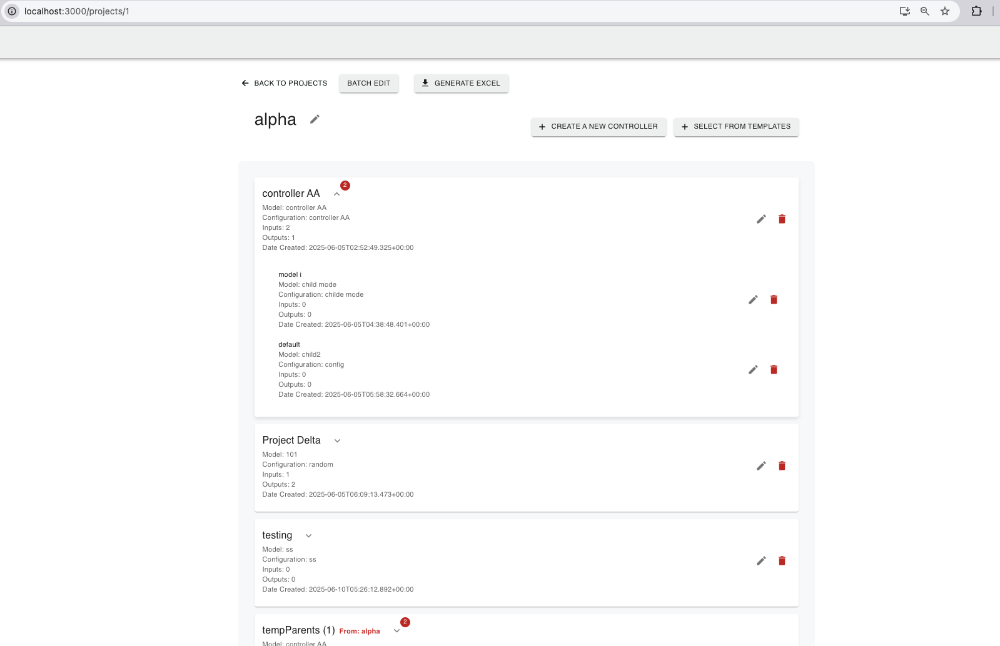
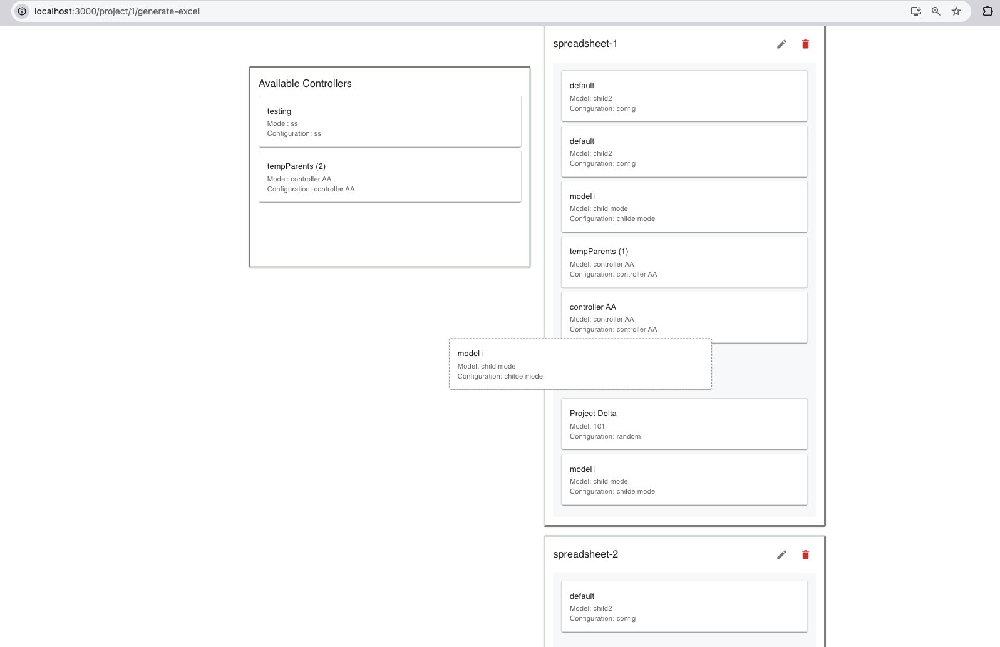

# BMS Modeling Platform

A comprehensive Building Management System (BMS) modeling platform that allows users to create, manage, and simulate building control systems.

## Features

- User authentication and authorization
- Project management
- Controller configuration and management
- Real-time simulation capabilities
- Interactive UI for system modeling

## Screenshots

### Controller Management


### Drag and Drop Interface


## Prerequisites

- Java JDK 17
- Maven
- Node.js (v18 or higher)
- npm (Node package manager)
- IntelliJ IDEA (recommended for backend development)
- VS Code (recommended for frontend development)


## Setup Instructions

### Backend Setup

1. Open the project in IntelliJ IDEA:
   - Open IntelliJ IDEA
   - Select "Open" and navigate to the `backend` directory
   - Wait for IntelliJ to index the project and download dependencies

2. Configure the application:
   - Ensure your `application.properties` or `application.yml` is properly configured
   - Set up your database connection if required

3. Run the application:
   - Find the main application class (usually annotated with `@SpringBootApplication`)
   - Right-click and select "Run" or use the green play button
   - Alternatively, use npm: `npm start`

The backend server will run on `http://localhost:8080`

### Frontend Setup

1. Navigate to the frontend directory:
   ```bash
   cd frontend/react-files
   ```

2. Install dependencies:
   ```bash
   npm install
   ```

3. Start the development server:
   ```bash
   npm start
   ```

The frontend application will run on `http://localhost:3000`

## API Documentation

Once the backend server is running, you can access the API documentation at:
- Swagger UI: `http://localhost:8080/swagger-ui.html`
- OpenAPI JSON: `http://localhost:8080/v3/api-docs`

## Development

### Backend Development

- The backend is built with Spring Boot
- Controllers are organized in the `controller` package
- Services are implemented in the `service` package
- Data models are defined in the `model` package
- Repository interfaces are in the `repository` package

### Frontend Development

- The frontend is built with React and TypeScript
- Components are organized in the `src/components` directory
- Pages are defined in the `src/pages` directory
- Styling is done using CSS Modules in the `src/styles` directory
- API calls are managed through Axios in the `src/api` directory

## Contributing

1. Fork the repository
2. Create a feature branch
3. Commit your changes
4. Push to the branch
5. Create a Pull Request

## License

This project is licensed under the MIT License - see the LICENSE file for details.


## task working on:

- create, save and retrieve the controller templetes
- create, save and retrieve expansion
- selecting expansion based on the manufacture
- model number with prestored JSON
- excel generating
- preFilled value COM